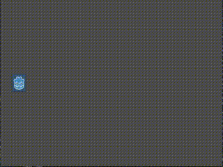
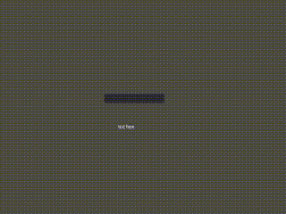
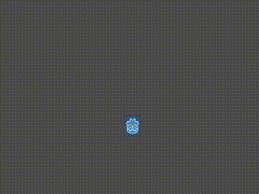
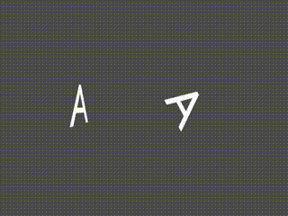
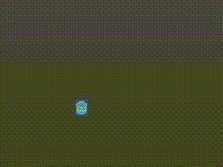

## Exercise 1
Make a game with 4 buttons on the screen adges, and print the button number on the screen center.

## Exercise 2
Add Label node indefinitely every 0.5 seconds with the viewport position as the text. 

hint 1) get_viewport().size gets the view port size.

hint 2) var some_label = Label.new() creates a Label node

hint 3) add_child(some_label) will add a child to the node

hint 4) you can use timer node

## Exercise 3
Make the Godot icon go back and forth the screen.

hint 1) otherwise use else if, with _physics_process(delta), or use physics related nodes.

hint 2) if you use _physics_process(delta), you might need a flag to determine if it is going left or right, and add
 100*delta to the x position.

## Exercise 4
make 2 squares move independently based on different keystrokes.

hint 1) you can use color_rect node for the squares.

hint 2) you can use input map in the settings. with _physics_process.

## Exercise 5
Drop an object onto a hard surface

hint 1) use rigidbody2d node with collisionshap2D node as a child for the drop

hint 2) use kinematicbody2d node with collisionshap2d as a child

## Exercise 6
Mirror a text input

hint 1) use lineedit node

hint 2) emit an apropriate signal

## Exercise 7
Bounce a ball around the screen like a DVD player. (no coding required but  very tricky)

hint 1) use RigidBody2D node, and set gravity scale to 0, linear velocity (which is the initial velocity) to 100, 100. Damping to 0. Mode to Chharacter, and add an icon and collisionshape2d

hint 2) Create 4 walls with Staticbody2D with a collisionshape2d child, make a physics material (right click on res:// then new_resource) and add that created material. Bounce should be 1 too.

hint3) make all damping gravity scale and friction zero. Also go to project settings, phsycis>2D and set everything to zero there too 

## Exercise 8
We are ready to Make Pong!

hint 1) combine previous exercises.

hint 2) You can always free and add children. (like the ball)

## Exercise 9
Make a nice looking HUD for the pong you made.

hint 1) Instead of buttons, you can use texture button and find assets for it.

hint 2) Find a nice background.

hint 3) use get_tree().change_scene() or get_tree().change_scene_to() for transitioning scenes.

hint 4) (optional) If motivated, nice animations and music like phasing in and running theme music would be nice.

## Exercise 10
Add sound effects to the pong you made.

hint 1) You can use AudioStreamPlayer node.

## Exercise 11
Make the letter A rotate along the y-axis and z-axis.

hint 1) you can use set_rotate(get_rotation + delta) for y-axis in _physics_process, or use animation node, or use some interpolation method. 

hint 2) there is an image sequence in the main git bransh which you can use in AnimatedSprite node. (if you are motivated you can try out a 3D scene instead)

## Exercise 12
Use tween for an Icon to follow your mouse click. The click should be disabled while the Icon is moving.

hint 1) Use tween node, with yield.

hint 2) Just for simplicity, you can use the button as the whole back ground.
