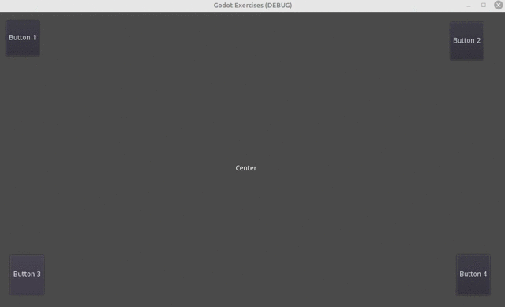
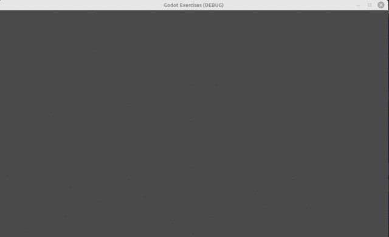
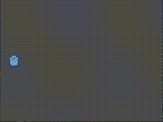

## Exercise 1
Make a game with 4 buttons on the screen adges, and print the button number on the screen center.

## Exercise 2
Add Label node indefinitely every 0.5 seconds with the viewport position as the text. 

hint 1) get_viewport().size gets the view port size.

hint 2) var some_label = Label.new() creates a Label node

hint 3) add_child(some_label) will add a child to the node

## Exercise 3
Make the Godot icon go back and forth the screen.

hint 1) otherwise use else if, with _physics_process(delta), or use physics related nodes.

hint 2) if you use _physics_process(delta), you might need a flag to determine if it is going left or right, and add
 100*delta to the x position.

hint 3) there might be other hacks! (maybe using timers?)
